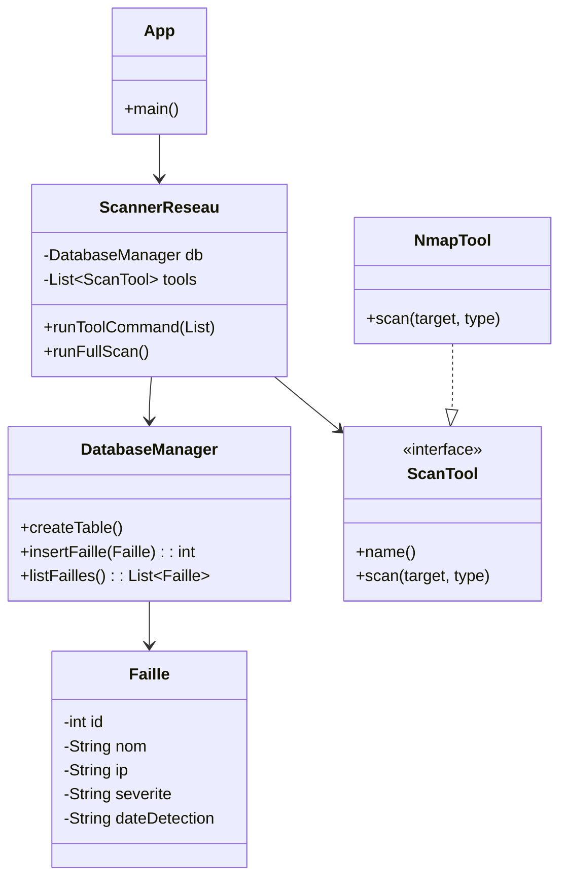

# 🛡️ SAE302 - Scanner & Gestion des Failles (Cybersécurité) 2025/2026

**Groupe :** SAMPEREZ Alexandre, BADAOUI Walid, CRUZ-MERMY Julien

---

## 🎯 Objectif du Projet (Exigence SAE)

Ce projet vise à développer une chaîne complète d'applications communicantes dans le domaine de la cybersécurité:

1.  **Application Java** : Scan du réseau local pour identifier les failles (ports ouverts, services).
2.  **Base de Données (SQLite)** : Stockage des résultats du scan.
3.  **Site Web & API JSON** : Lecture des failles depuis la base de données et affichage.
4.  **Application Android** : Communication avec l'API Web pour visualiser les failles.

Le prototype Java ci-dessous démontre le flux : **Scanner (plugins) → Database (SQLite) → Affichage console**.ns par des wrappers d'outils réels (nmap, nikto, ...) et API web.

---

## Équipe & RACI (synthèse)


> Tous = **I** sur tout (capables d’expliquer l’ensemble).

**RACI résumé (version courte)**  
- **Walid** : Responsable & Accountable (R/A) pour toute la partie **Java** (Faille, DatabaseManager, ScannerReseau, App).  
- **Alexandre** : Responsable & Accountable (R/A) pour **site web / backend**.  
- **Julien** : Responsable & Accountable (R/A) pour **Android** (UI / intégration) et tests.  
> Note : chaque membre produit un court rapport individuel sur l'usage de l'IA (`IA_report_<nom>.md`).

---

## Diagramme simplifié des classes (Mermaid)

## 🏗️ Diagramme de l'Architecture Java (Mermaid)

Le cœur du projet Java repose sur l'injection de dépendances et les interfaces, permettant l'ajout de nouveaux outils (plugins) sans modifier l'orchestrateur.


---

## ⚙️ Manuel d’installation et d’utilisation

### 1️⃣ Prérequis

* **JDK 11+** installé
  Vérifier :

  ```bash
  javac -version
  java -version
  ```
* **Driver JDBC SQLite (Xerial)** :
  Télécharger [`sqlite-jdbc-3.51.0.0.jar`](https://github.com/xerial/sqlite-jdbc) et le placer dans `lib/` ou `src/`.
* (Optionnel) **DB Browser for SQLite** pour visualiser `failles.db`.
* Fonctionne sur **Windows**, **Linux** et **macOS**.

---

### 2️⃣ Installation

1. Cloner le dépôt :

   ```bash
   git clone <URL_DU_REPO>
   cd <repo>/src
   ```
2. Copier le fichier `sqlite-jdbc-3.51.0.0.jar` dans `src/` ou `lib/`.

---

### 3️⃣ Compilation

Dans le dossier `src` :

```bash
cd <repo>/src
# Compilation de tous les fichiers .java en incluant le JAR dans lib/
javac -cp "../lib/*:." *.java
```

---

### 4️⃣ Exécution

#### Sous **Windows**

```powershell
java -cp ".;sqlite-jdbc-3.51.0.0.jar" App
```

#### Sous **Linux / macOS**

```bash
# Exécution du programme
java -cp "../lib/sqlite-jdbc-3.51.0.0.jar:." App
```

---

### 5️⃣ Scénario de vérification (TD2)

1. **1 →** Créer la table `failles`.
2. **2 →** Lancer la détection simulée (ajoute 2 failles factices).
3. **3 →** Lister toutes les failles.
4. **6 →** Enregistrer `DummyTool` (plugin de test).
5. **9 →** Ajouter une cible (ex. `192.168.1.10`).
6. **8 →** Lancer `runFullScan()` (tous les outils sur toutes les cibles).
7. **3 →** Relister pour vérifier les nouvelles entrées.
8. **10 →** Supprimer une faille (test delete).
9. **11 →** Modifier une faille (test update).

---

### 6️⃣ Vérification dans la base

Ouvrir la base `failles.db` :

```bash
sqlite3 failles.db
```

Commandes utiles :

```sql
SELECT COUNT(*) FROM failles;
SELECT id, nom, ip, severite FROM failles LIMIT 10;
```

Nettoyer les doublons :

```sql
DELETE FROM failles
WHERE id NOT IN (
  SELECT MIN(id)
  FROM failles
  GROUP BY nom, description, ip, severite, source, dateDetection, reference
);
```

Exporter la base :

```bash
sqlite3 failles.db ".dump" > init_db.sql
```

---

### 7️⃣ Structure du dépôt

| Dossier/Fichier                | Description                    |
| ------------------------------ | ------------------------------ |
| `src/Faille.java`              | Classe modèle de vulnérabilité |
| `src/DatabaseManager.java`     | CRUD SQLite complet            |
| `src/ScannerReseau.java`       | Gestion des cibles + outils    |
| `src/ScanTool.java`            | Interface pour plugins         |
| `src/DummyTool.java`           | Exemple d’outil factice        |
| `src/App.java`                 | Menu console principal         |
| `lib/sqlite-jdbc-3.51.0.0.jar` | Driver SQLite                  |
| `failles.db` / `init_db.sql`   | Base de données                |
| `screens/`                     | Captures de démo               |
| `README.md`                    | Documentation et manuel        |

---

### 8️⃣ Ajouter un nouvel outil

Créer une classe implémentant `ScanTool` :

```java
public class MyNmapTool implements ScanTool {
    public String name() { return "nmap"; }
    public List<Faille> scan(String target) {
        return List.of(new Faille(0, "Test", "Port 22 ouvert", target, "LOW", "nmap", "2025-11-08", "NMAP-01"));
    }
}
```

Enregistrer le nouvel outil :

```java
scanner.registerTool(new MyNmapTool());
```

Puis exécuter via :

```
Option 8 → Run full scan
```

---

### 📧 Contacts

* **Walid Badaoui** — Java / SQLite / Scanner
* **Alexandre Samperez** — site web
* **Julien Cruz-Mermy** — Android / tests
* Pour toute question : ouvrir une *Issue* dans le dépôt GitHub.

---

**Fichiers obligatoires :**

* `src/*.java`
* `lib/sqlite-jdbc-3.51.0.0.jar`
* `failles.db` ou `init_db.sql`
* `screens/`
* `README.md` (ce fichier)
* `RACI.md`
* `IA_report_<nom>.md`

---


✅ **Ce README sert de documentation et  de manuel d’installation.**
