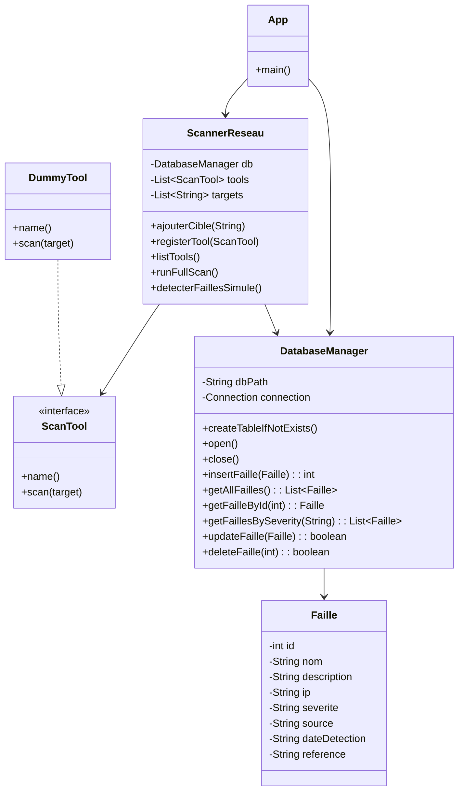

# SAE302 - Prototype Scanner & Gestion des failles 2025/2026

Groupe constituée de **SAMPEREZ Alexandre (spalexandre13)**, **BADAOUI Walid**, **CRUZ-MERMY Julien**

Ce projet vise à créer un site web qui répertorie toutes les photos du banc avionniques lors de l'utilisation du banc ou toutes les 24 heures sans utilisations. Ce site web contient la création d'un programme python ainsi que d'une base de donnée fonctionnel.

---

## Objectif SAE302
Prototype Java démontrant le flux : **Scanner (plugins) → Database (SQLite) → Affichage / API**.  
Version TD2 : simulation et plugin system (`DummyTool`).  
TD3 : remplacement des simulations par des wrappers d'outils réels (nmap, nikto, ...) et API web.

---

## Équipe & RACI (synthèse)


> Tous = **I** sur tout (capables d’expliquer l’ensemble).

**RACI résumé (version courte)**  
- **Walid** : Responsable & Accountable (R/A) pour toute la partie **Java** (Faille, DatabaseManager, ScannerReseau, App).  
- **Alexandre** : Responsable & Accountable (R/A) pour **site web / backend**.  
- **Julien** : Responsable & Accountable (R/A) pour **Android** (UI / intégration) et tests.  
> Note : chaque membre produit un court rapport individuel sur l'usage de l'IA (`IA_report_<nom>.md`).

---

## Diagramme simplifié des classes (Mermaid)


```mermaid
classDiagram
    class App {
        +main()
    }
    class ScannerReseau {
        -DatabaseManager db
        -List~ScanTool~ tools
        -List~String~ targets
        +ajouterCible(String)
        +registerTool(ScanTool)
        +listTools()
        +runFullScan()
        +detecterFaillesSimule()
    }
    class ScanTool {
        <<interface>>
        +name()
        +scan(target)
    }
    class DummyTool {
        +name()
        +scan(target)
    }
    class DatabaseManager {
        -String dbPath
        -Connection connection
        +createTableIfNotExists()
        +open()
        +close()
        +insertFaille(Faille) : int
        +getAllFailles() : List~Faille~
        +getFailleById(int) : Faille
        +getFaillesBySeverity(String) : List~Faille~
        +updateFaille(Faille) : boolean
        +deleteFaille(int) : boolean
    }
    class Faille {
        -int id
        -String nom
        -String description
        -String ip
        -String severite
        -String source
        -String dateDetection
        -String reference
    }

    App --> ScannerReseau
    App --> DatabaseManager
    ScannerReseau --> ScanTool
    ScannerReseau --> DatabaseManager
    DummyTool ..|> ScanTool
    DatabaseManager --> Faille
```

---

## ⚙️ Manuel d’installation et d’utilisation

### 1️⃣ Prérequis

* **JDK 11+** installé
  Vérifier :

  ```bash
  javac -version
  java -version
  ```
* **Driver JDBC SQLite (Xerial)** :
  Télécharger [`sqlite-jdbc-3.51.0.0.jar`](https://github.com/xerial/sqlite-jdbc) et le placer dans `lib/` ou `src/`.
* (Optionnel) **DB Browser for SQLite** pour visualiser `failles.db`.
* Fonctionne sur **Windows**, **Linux** et **macOS**.

---

### 2️⃣ Installation

1. Cloner le dépôt :

   ```bash
   git clone <URL_DU_REPO>
   cd <repo>/src
   ```
2. Copier le fichier `sqlite-jdbc-3.51.0.0.jar` dans `src/` ou `lib/`.

---

### 3️⃣ Compilation

Dans le dossier `src` :

```bash
javac *.java
```

---

### 4️⃣ Exécution

#### Sous **Windows**

```powershell
java -cp ".;sqlite-jdbc-3.51.0.0.jar" App
```

#### Sous **Linux / macOS**

```bash
java -cp ".:sqlite-jdbc-3.51.0.0.jar" App
```

---

### 5️⃣ Scénario de vérification (TD2)

1. **1 →** Créer la table `failles`.
2. **2 →** Lancer la détection simulée (ajoute 2 failles factices).
3. **3 ‚Üí** Lister toutes les failles.
4. **6 ‚Üí** Enregistrer `DummyTool` (plugin de test).
5. **9 ‚Üí** Ajouter une cible (ex. `192.168.1.10`).
6. **8 ‚Üí** Lancer `runFullScan()` (tous les outils sur toutes les cibles).
7. **3 →** Relister pour vérifier les nouvelles entrées.
8. **10 ‚Üí** Supprimer une faille (test delete).
9. **11 ‚Üí** Modifier une faille (test update).

---

### 6️⃣ Vérification dans la base

Ouvrir la base `failles.db` :

```bash
sqlite3 failles.db
```

Commandes utiles :

```sql
SELECT COUNT(*) FROM failles;
SELECT id, nom, ip, severite FROM failles LIMIT 10;
```

Nettoyer les doublons :

```sql
DELETE FROM failles
WHERE id NOT IN (
  SELECT MIN(id)
  FROM failles
  GROUP BY nom, description, ip, severite, source, dateDetection, reference
);
```

Exporter la base :

```bash
sqlite3 failles.db ".dump" > init_db.sql
```

---

### 7️⃣ Structure du dépôt

| Dossier/Fichier                | Description                    |
| ------------------------------ | ------------------------------ |
| `src/Faille.java`              | Classe modèle de vulnérabilité |
| `src/DatabaseManager.java`     | CRUD SQLite complet            |
| `src/ScannerReseau.java`       | Gestion des cibles + outils    |
| `src/ScanTool.java`            | Interface pour plugins         |
| `src/DummyTool.java`           | Exemple d’outil factice        |
| `src/App.java`                 | Menu console principal         |
| `lib/sqlite-jdbc-3.51.0.0.jar` | Driver SQLite                  |
| `failles.db` / `init_db.sql`   | Base de données                |
| `screens/`                     | Captures de démo               |
| `README.md`                    | Documentation et manuel        |

---

### 8️⃣ Ajouter un nouvel outil

Créer une classe implémentant `ScanTool` :

```java
public class MyNmapTool implements ScanTool {
    public String name() { return "nmap"; }
    public List<Faille> scan(String target) {
        return List.of(new Faille(0, "Test", "Port 22 ouvert", target, "LOW", "nmap", "2025-11-08", "NMAP-01"));
    }
}
```

Enregistrer le nouvel outil :

```java
scanner.registerTool(new MyNmapTool());
```

Puis exécuter via :

```
Option 8 ‚Üí Run full scan
```

---

### üìß Contacts

* **Walid Badaoui** — Java / SQLite / Scanner
* **Alexandre Samperez** — site web
* **Julien Cruz-Mermy** — Android / tests
* Pour toute question : ouvrir une *Issue* dans le dépôt GitHub.

---

### 📦 Livraison TD2

**Fichiers obligatoires :**

* `src/*.java`
* `lib/sqlite-jdbc-3.51.0.0.jar`
* `failles.db` ou `init_db.sql`
* `screens/`
* `README.md` (ce fichier)
* `RACI.md`
* `IA_report_<nom>.md`

---

✅ **Ce README sert de documentation, de manuel d’installation et de livrable officiel pour le TD2.**
